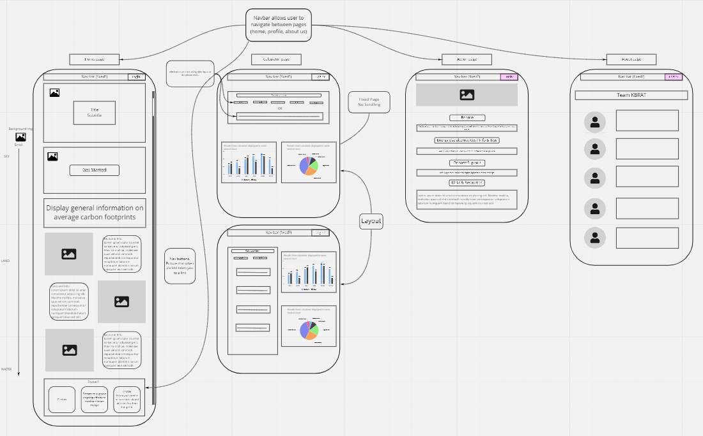
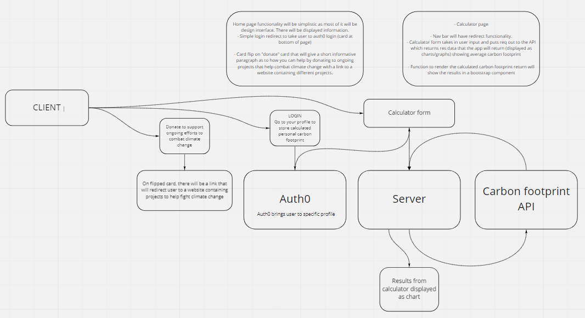
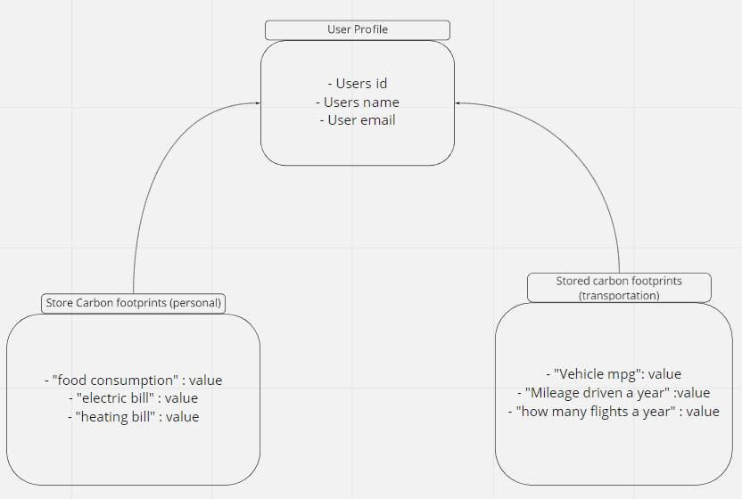

# Carbon Footprint Calculator ***(App title TBD)***

## Team KBRAT Members

Alex Grazda  
Brandon Rimes  
Chattray Chea  
Kyle Cohen  
Ryan Emmans

- Our application will enable a user to input data based on their habits and lifestyle. The input will then calculate the user's carbon footprint.

- The pain point that this would be solving is helping and educating users to realize the impact they have on the earth every day. Just the education alone will help spread the word and make for more thought out decisions among the community.

- Our MVP is to have a working app that can calculate at least an average yearly footprint for a user based on transportation data input.

- Stretch goals will include input for food consumption and home utility use.

## Wireframe  

## DOM  

## Schema  

  

## User Stories  

### User Story #1  

- As an environmentally conscious human, I want to see environmental data displayed aesthetically and enter my own data to see my personal contribution.  

### User Story #2

- As a user I would like to eliminate user error in the footprint calculator by only allowing user input as a drop down or slider.  

### User Story #3  

- “As a user, I want information, statistics, and images on the landing page to learn why my carbon footprint matters.”  

### User Story #4  

- As a user I would like the ability to see how large of a footprint I have, ways I can reduce my own footprint, and ways I can contribute as an individual by having the ability to find projects that I can donate to or support by sharing information.

### User Story #5

- As a user, I want to have the ability to log in and create a profile so I can access my specific data for future use.
